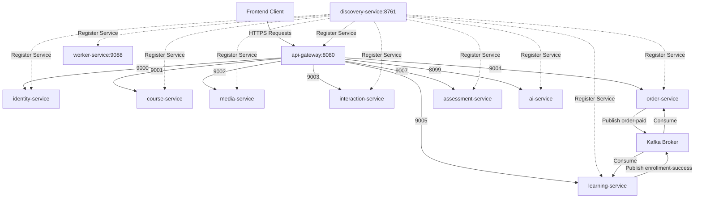

# 🎓 E-Learning Platform - Hệ Thống Microservices Đào Tạo Trực Tuyến

> **Hệ thống phân tán tích hợp Trí tuệ Nhân tạo (AI RAG), Bảo vệ bản quyền video DRM HLS, Giao dịch phân tán Saga và Cổng thanh toán VNPay.**

---

## 🏛️ 1. Bản Đồ Kiến Trúc Hệ Thống (System Architecture Map)

Hệ thống được thiết kế theo kiến trúc **Microservices** phân rã hoàn toàn, giao tiếp đồng bộ qua **REST / OpenFeign** và bất đồng bộ qua **Apache Kafka**, bảo mật tập trung qua **Keycloak (OAuth2/OIDC)** và **API Gateway**.



---

## 📂 2. Danh Sách Các Microservices & Công Nghệ Sử Dụng

Hệ thống bao gồm **12 mô-đun nghiệp vụ chính** hoạt động độc lập:

| Mô-đun (Service)           | Cổng (Port) | Cơ sở dữ liệu (Database)    | Công nghệ & Nhiệm vụ cốt lõi                                                                                                                                    |
| :------------------------- | :---------: | :-------------------------- | :-------------------------------------------------------------------------------------------------------------------------------------------------------------- |
| **`api-gateway`**          |   `8080`    | _Không_                     | **Spring Cloud Gateway**. Định tuyến, Rate Limiting, CORS, phân quyền JWT.                                                                                      |
| **`discovery-service`**    |   `8761`    | _Không_                     | **Netflix Eureka Server**. Đăng ký và phát hiện dịch vụ tự động.                                                                                                |
| **`common-library`**       | _Thư viện_  | _Không_                     | **Shared Core**. Định nghĩa DTO dùng chung, AOP Custom Annotations (`@CheckCourseOwner`), Exception Handler tập trung.                                          |
| **`identity-service`**     |   `9000`    | PostgreSQL (`identity_db`)  | **Keycloak, Redis**. Đăng ký/đăng nhập, phân quyền RBAC, kiểm tra danh sách đen Token logout lưu trên Redis (`RedisBlacklistJwtValidator`).                     |
| **`course-service`**       |   `9001`    | MongoDB (`course_db`)       | Quản lý danh mục khóa học, chương học, bài giảng đa phương tiện.                                                                                                |
| **`media-service`**        |   `9002`    | MongoDB (`media_db`)        | **MinIO, FFmpeg**. Sinh Presigned URL để upload video siêu tốc bỏ qua Gateway, nén nạp HLS Stream mã hóa bản quyền **DRM AES-128**.                             |
| **`interaction-service`**  |   `9003`    | MongoDB (`interaction_db`)  | Quản lý Hỏi đáp bài học (Discussion), Đánh giá khóa học (Reviews) và Ticket hỗ trợ (Feedback).                                                                  |
| **`order-service`**        |   `9004`    | PostgreSQL (`order_db`)     | **VNPay, Outbox Pattern**. Đơn hàng, giỏ hàng, IPN Webhook VNPay. Sử dụng **Transactional Outbox** gửi Kafka tin cậy.                                           |
| **`learning-service`**     |   `9005`    | MongoDB (`learning_db`)     | Đăng ký học viên, theo dõi tiến độ xem video bài học từng giây, tự động tính % hoàn thành khóa học để cấp chứng chỉ.                                            |
| **`notification-service`** |   `9006`    | MongoDB (`notification_db`) | Gửi Email chào mừng, xác nhận thanh toán bất đồng bộ qua Kafka.                                                                                                 |
| **`assessment-service`**   |   `9007`    | MongoDB (`assessment_db`)   | Quản lý ngân hàng câu hỏi, bài tập lớn, chấm điểm trắc nghiệm tự động.                                                                                          |
| **`worker-service`**       |   `9088`    | _Không_                     | **Apache PDFBox, JAVE2**. Offload tác vụ nặng nền: Trích xuất slide PDF, tách nhạc MP3 và chuyển thể giọng nói (Speech-to-Text).                                |
| **`ai-service`**           |   `8099`    | PostgreSQL (`pgvector`)     | **Spring AI, Gemini API, RAG**. Trợ lý ảo AI Tutor RAG trả lời thông minh dựa trên giáo trình khóa học, tự động tạo câu hỏi trắc nghiệm (Smart Quiz Generator). |

---

## 💎 3. Các Điểm Sáng Kỹ Thuật Độc Đáo (Enterprise Architectural Highlights)

1. **Giao Dịch Phân Tán Saga (Choreography):**
   Quy trình mua hàng và ghi danh học viên được khép kín tự động qua hệ thống Message Broker **Kafka**. Tránh lỗi thất thoát tiền hoặc ghi danh khống nhờ cơ chế phản hồi trạng thái `SUCCESS / FAILED` và giao dịch bù (Compensating Transaction - Undo).
2. **Transactional Outbox Pattern:**
   Đảm bảo tính nhất quán cuối cùng (**Eventual Consistency**) giữa Database PostgreSQL và Kafka trong `order-service`. Tránh lỗi Dual-write bằng cách commit trạng thái Đơn hàng và Outbox Event trong cùng một Database Transaction.
3. **DRM HLS Video Adaptive Streaming (Bảo vệ bản quyền):**
   Video tải lên được cắt lát thành các phân đoạn `.ts` mã hóa cứng AES-128. Trình phát video chỉ có thể lấy khóa giải mã thông qua API bảo vệ chéo bằng Feign Client kết nối tới `learning-service` kiểm tra quyền sở hữu khóa học. Chống tải trộm video 100%!
4. **Kiến Trúc AI RAG Cô Lập Hiệu Năng (Decoupled Compute):**
   Tác vụ xử lý PDF và Video thô nặng nề được đẩy ngầm qua Kafka cho `worker-service` làm việc độc lập. `ai-service` chỉ tập trung kết nối `pgvector` và Gemini LLM để phản hồi nhanh nhất câu hỏi Chatbot hỗ trợ học tập của học viên.

---

## 🚀 4. Hướng Dẫn Cài Đặt Và Khởi Chạy (Quick Start Guide)

### 📋 4.1. Yêu Cầu Hệ Thống (Prerequisites)

- Java JDK 17 trở lên.
- Docker và Docker Desktop.
- Maven 3.8+.
- FFmpeg (đã cài đặt và cấu hình Path).

### 🐳 4.2. Khởi Chạy Hạ Tầng Bằng Docker Compose

Chạy các dịch vụ cơ sở dữ liệu và trung gian (PostgreSQL, MongoDB, Kafka, Redis, MinIO, Keycloak) từ thư mục gốc:

```powershell
docker-compose -f docker/docker-compose.yml up -d
```

### 🛠️ 4.3. Biên Dịch Toàn Bộ Dự Án (Maven Multi-Module)

Biên dịch dự án từ thư mục gốc để tải và cài đặt toàn bộ dependencies cũng như cài đặt `common-library`:

```powershell
.\mvnw clean compile
```

### 🏃 4.4. Trình Tự Khởi Chạy Các Dịch Vụ (Startup Order)

Để hệ thống khởi chạy ổn định, hãy tuân thủ trình tự sau:

1. **Dịch vụ Đăng Ký:** Khởi chạy `discovery-service` (Eureka Server) trước để các dịch vụ khác có chỗ đăng ký.
2. **Dịch vụ Cổng và Xác thực:** Khởi chạy `api-gateway` và `identity-service`.
3. **Các Dịch vụ Nghiệp vụ:** Chạy các dịch vụ `course-service`, `media-service`, `interaction-service`, `order-service`, `learning-service`, `notification-service`, `assessment-service`.
4. **Các Dịch vụ Xử lý Nền & AI:** Khởi chạy `worker-service` và `ai-service`.

Bạn có thể chạy trực tiếp từng dịch vụ bằng Maven từ thư mục của dịch vụ đó:

```powershell
.\mvnw spring-boot:run
```

---

## 🔒 5. Bảo Mật & Xác Thực (Security Framework)

- Hệ thống áp dụng chuẩn bảo mật **OAuth2** kết hợp máy chủ định danh **Keycloak**.
- **Phân quyền người dùng:** Gồm 3 nhóm quyền chính: `STUDENT` (Học viên), `INSTRUCTOR` (Giảng viên sở hữu khóa học), và `ADMIN` (Quản trị viên hệ thống).
- **Phân quyền khóa học chặt chẽ:** Sử dụng AOP Annotation `@CheckCourseOwner` đi kèm các Component Resolvers linh hoạt giúp xác minh quyền sở hữu tài nguyên khóa học theo thời gian thực (Real-time Ownership Verification) trên môi trường phân tán.

---
